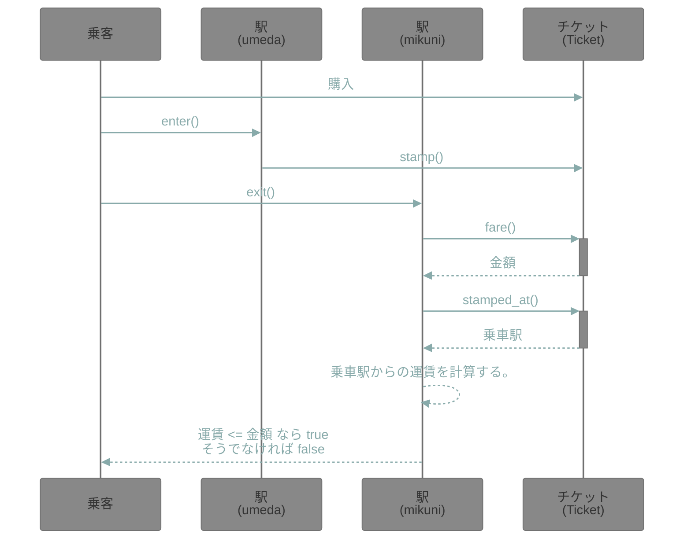
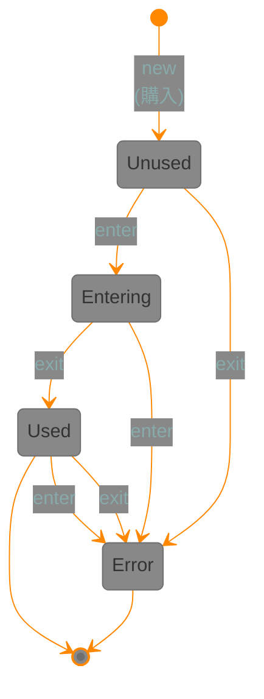

# rspec の技法

## 概要

書籍「プロを目指す人のためのRuby入門 改訂2版（2021年12月発売）」のサンプルコードを、自分なりに変更してみていきます。

更に他の web ページの例なども追加しています。

## 実行方法

```sh
$rake -T
rake test  # Run tests

$rake test
$open coverage/index.html

$rspec
$open coverage/index.html

# 結果を slack に投稿する (webhook を設定し、環境変数 SLACK_WEBHOOK_URL にそれを設定すること)
rspec spec -f SlackFormatter

```

## Docker で実行する

```script
$ docker-compose up -d
$ docker-compose exec app bundle exec rspec
$ open coverage/index.html
~~~

## spec ファイル一覧

```text
spec
├── cassettes                      // ccr の カセットデータ
│   └── Weather
│       └── self_weather
│           └── 妥当なcode
│               └── 東京の情報.yml
├── convert_hash_syntax_spec.rb
├── convert_length_spec.rb
├── effects_spec.rb
├── fizz_buzz_spec.rb
├── gate_spec.rb
├── log_formatter_spec.rb
├── message_filter_spec.rb        // message_filter の 第 4 イテレーションの試み
├── poll_spec.rb                  // mock を使ってテストする例
├── rgb_spec.rb
├── spec_helper.rb
├── ticket_spec.rb
└── weather_spec.rb               // 外部の天気予報 API の利用メソッドを vcr を利用してテストする例
```

## 参考

- <https://github.com/JunichiIto/ruby-book-codes-v2>

- <https://github.com/minitest-reporters/minitest-reporters>

- <https://qiita.com/jnchito/items/60ea1389d00e72b729e7>

- <https://qiita.com/eighty8/items/124cd7a51d84df1d4a46>
  RSpecを単体で使いたい on Docker

- <https://t-wada.hatenadiary.jp/entry/20100801/rspec_3rd_iter>
  RSpec の入門とその一歩先へ、第3イテレーション

- <https://zenn.dev/yuji_developer/articles/52cc0e356b3748>
  rspecを読みやすくメンテしやすく書くために

## mermaid で書いた例

### シーケンス図



### チケットの状態遷移図


