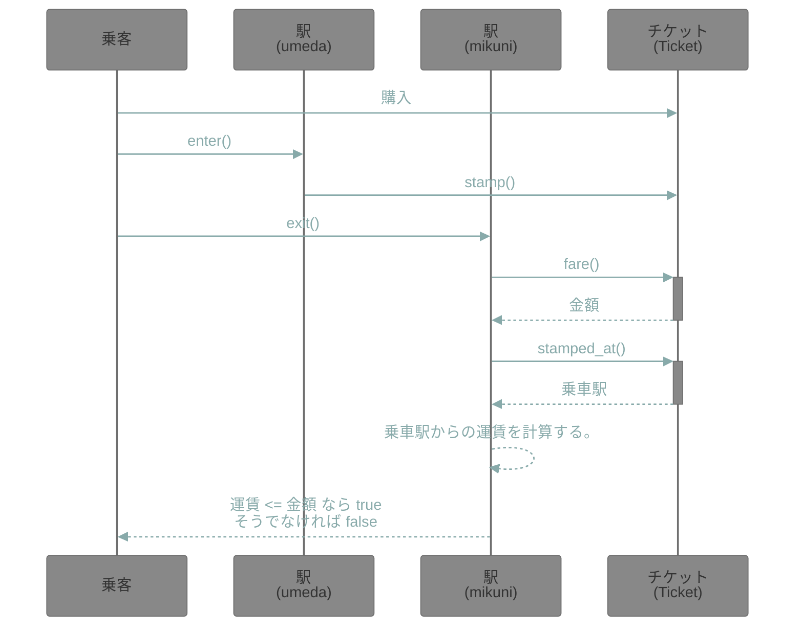
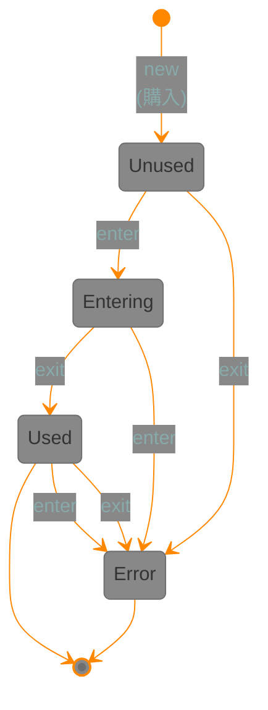

# 概要

書籍「プロを目指す人のためのRuby入門 改訂2版（2021年12月発売）」のサンプルコードを、自分なりに変更してみていきます。

## 参考

<https://github.com/JunichiIto/ruby-book-codes-v2>

<https://github.com/minitest-reporters/minitest-reporters>

<https://qiita.com/jnchito/items/60ea1389d00e72b729e7>

## mermaid で書いた例

### シーケンス図

### チケットの状態遷移図

