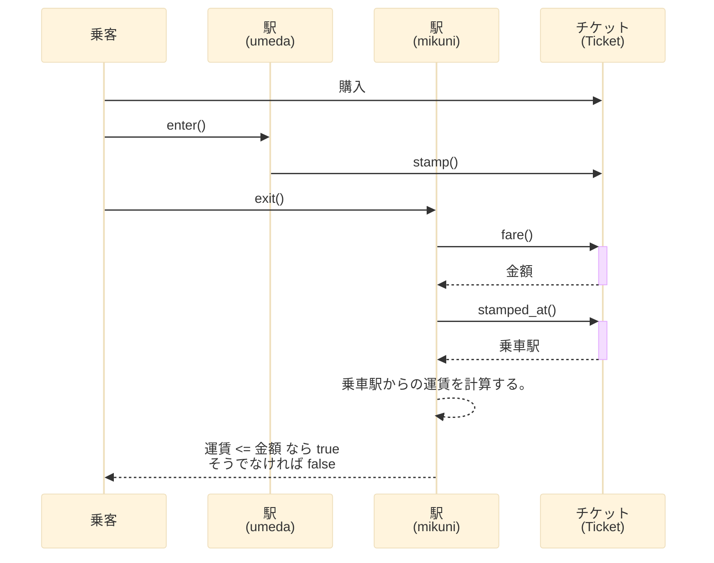

# UML図

## gate, ticket

gate, ticket のやりとりのシーケンス図を示します。

```mermaid

%%{init: {'securityLevel': 'loose', 'theme':'base'}}%%
%%  -- {init: {'theme': 'base', 'themeVariables': { 'primaryColor': '#aaffff', 'edgeLabelBackground':'#ffffee', 'tertiaryColor': '#fff0f0'}}}  

sequenceDiagram

participant A as 乗客
participant G1 as 駅<br/>(umeda)
participant G2 as 駅<br/>(mikuni)
participant T as チケット<br/>(Ticket)

A->>T: 購入
A->>G1: enter()
G1->>T: stamp()

A->>G2: exit()
G2->> + T: fare()
T-->> - G2: 金額
G2->> + T: stamped_at()
T-->> - G2: 乗車駅
G2-->>G2: 乗車駅からの運賃を計算する。

G2-->>A: 運賃 <= 金額 なら true<br/>そうでなければ false
```
